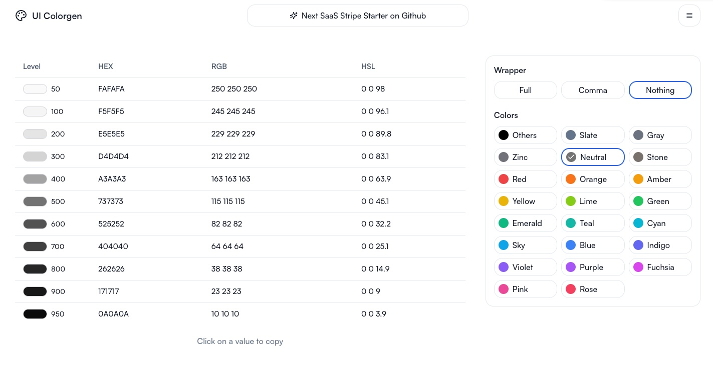

# UI Colorgen

An ui colorgen application built to help you with color setup in **shadcn/ui**.




## About this project

This project is a user interface application designed to facilitate color setup in shadcn/ui. It provides a list of TailwindCSS colors in different formats (hex, rgb, hsl) and allows users to update color variables using a Color Picker. Users can also select their preferred format. Ui colorgen generates variables for root in globals.css and creates the color section for tailwind.config.js.

## Features

- List of colors **TailwindCSS** (hex, rgb, hsl)
- Update colors variables with **Color Picker**
- Add your **own variables** in the list 
- **Select initial color** for your variables
- **Select the format** that suits you best
- **Generate variables** for root in `globals.css`
- **Generate colors part** for `tailwind.config.js`

## Running Locally

1. Install dependencies using pnpm:

```sh
pnpm install
```

2. Copy `.env.example` to `.env.local` and update the variables.

```sh
cp .env.example .env.local
```

3. Start the development server:

```sh
pnpm dev
```

## License

Licensed under the [MIT license](https://github.com/mickasmt/ui-colorgen/blob/main/LICENCE.md).
